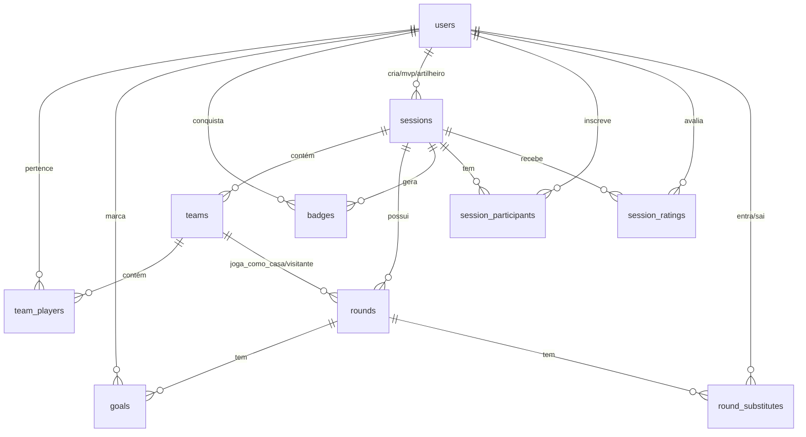

# Modelagem do Banco de Dados - Racha (Metanol FC)

Este documento descreve a estrutura de dados do banco PostgreSQL (gerenciado via Prisma ORM) utilizada pelo sistema, incluindo as entidades existentes e as novas propostas para suportar as avaliações, controle de presenças e substituições.

---

## 1. Diagrama de Entidades (Mermaid)



---

## 2. Dicionário de Dados (Modelos Prisma)

### 2.1 Modelos Existentes

*   **User (`users`)**: Representa os jogadores cadastrados no sistema.
    *   `id` (String, UUID): Chave primária.
    *   `email` (String): E-mail único para login.
    *   `password` (String): Senha criptografada.
    *   `name` (String): Nome completo do jogador.
    *   `nickname` (String?): Apelido.
    *   `position` (Enum: ZAGUEIRO, MEIO, ATACANTE): Posição de preferência.
    *   `rating` (Int): Pontuação de habilidade (usada no balanceamento por Elo).
    *   `avatarIndex` (Int): Índice do avatar selecionado.
    *   `isAdmin` (Boolean): Flag de administrador do racha.
    *   `createdAt` (DateTime).

*   **Session (`sessions`)**: Representa o evento do racha (geralmente semanal).
    *   `id` (String, UUID): Chave primária.
    *   `title` (String?): Título do racha (ex: "Racha Metanol #42").
    *   `date` (DateTime): Data e hora de início.
    *   `status` (Enum: OPEN, IN_PROGRESS, FINISHED): Estado atual do evento.
    *   `createdById` (String): Referência ao Admin que criou a sessão.
    *   `mvpPlayerId` (String?): Jogador eleito MVP da sessão.
    *   `topScorerPlayerId` (String?): Jogador artilheiro da sessão.
    *   `createdAt` (DateTime).

*   **Team (`teams`)**: Os times sorteados para a sessão (geralmente Time A, Time B, etc.).
    *   `id` (String, UUID): Chave primária.
    *   `sessionId` (String): Referência à sessão vinculada.
    *   `name` (String): Nome do time (ex: "Vermelho", "Azul").
    *   `color` (String): Cor de representação.
    *   `totalRating` (Int): Rating acumulado do time (para balanceamento).

*   **TeamPlayer (`team_players`)**: Tabela pivô de relacionamento N:M entre times e jogadores.
    *   `id` (Int): Chave primária.
    *   `teamId` (String): Referência ao Time.
    *   `playerId` (String): Referência ao Jogador.

*   **Round (`rounds`)**: Representa cada partida de 7 minutos realizada na sessão.
    *   `id` (String, UUID): Chave primária.
    *   `sessionId` (String): Referência à sessão.
    *   `roundNumber` (Int): Número sequencial da rodada.
    *   `homeTeamId` (String): Time de Casa.
    *   `awayTeamId` (String): Time Visitante.
    *   `homeScore` (Int): Gols do time de casa.
    *   `awayScore` (Int): Gols do time visitante.
    *   `winnerTeamId` (String?): ID do time vencedor.
    *   `isDraw` (Boolean): Flag de empate.
    *   `createdAt` (DateTime).

*   **Goal (`goals`)**: Registro de gols individuais das partidas.
    *   `id` (Int): Chave primária.
    *   `roundId` (String): Referência à rodada.
    *   `playerId` (String): Referência ao jogador que fez o gol.
    *   `minute` (Int?): Minuto do gol.

*   **Badge (`badges`)**: Insígnias e conquistas acumuladas por jogadores.
    *   `id` (Int): Chave primária.
    *   `playerId` (String): Referência ao jogador.
    *   `type` (Enum: ARTILHEIRO, MVP, ON_FIRE, VETERANO, AZARADO, GOLEADOR).
    *   `sessionId` (String?): Referência opcional à sessão onde a conquistou.
    *   `earnedAt` (DateTime).

---

## 3. Novas Entidades Propostas (Próxima Implementação)

Para suportar as novas regras de negócio do racha, o `schema.prisma` deve ser estendido com as seguintes tabelas e campos:

### 3.1 Alterações em tabelas existentes
*   **User (`users`)**:
    *   `averageNote` (Float): Nova coluna para armazenar a nota média histórica das avaliações (padrão 6.0).
*   **Session (`sessions`)**:
    *   `maxPlayers` (Int): Limite máximo de jogadores confirmados para a sessão (padrão `15`).
    *   `pixKey` (String?): Chave Pix cadastrada pelo administrador para o recebimento do racha.
    *   `price` (Float?): Valor individual a ser pago pelos participantes da sessão.

### 3.2 Novas Tabelas

#### SessionParticipant (`session_participants`)
Controla as confirmações de presença e fila de espera.
```prisma
model SessionParticipant {
  id          String            @id @default(uuid())
  sessionId   String
  userId      String
  status      ParticipantStatus @default(CONFIRMED) // CONFIRMED ou WAITING_LIST
  isPaid      Boolean           @default(false)
  createdAt   DateTime          @default(now())

  session     Session           @relation(fields: [sessionId], references: [id])
  user        User              @relation(fields: [userId], references: [id])

  @@unique([sessionId, userId])
  @@map("session_participants")
}

enum ParticipantStatus {
  CONFIRMED
  WAITING_LIST
}
```

#### SessionRating (`session_ratings`)
Armazena a nota que um jogador dá para o outro em uma sessão específica.
```prisma
model SessionRating {
  id          String   @id @default(uuid())
  sessionId   String
  evaluatorId String
  evaluatedId String
  score       Int      // Valor de 1 a 10
  createdAt   DateTime @default(now())

  session     Session  @relation(fields: [sessionId], references: [id])
  evaluator   User     @relation("EvaluatedBy", fields: [evaluatorId], references: [id])
  evaluated   User     @relation("Evaluates", fields: [evaluatedId], references: [id])

  @@unique([sessionId, evaluatorId, evaluatedId]) // Impede avaliações duplicadas
  @@map("session_ratings")
}
```

#### RoundSubstitute (`round_substitutes`)
Controla quem substituiu temporariamente quem em uma rodada específica do racha.
```prisma
model RoundSubstitute {
  id          String   @id @default(uuid())
  roundId     String
  playerOutId String   // Jogador original que saiu
  playerInId  String   // Jogador substituto que entrou
  createdAt   DateTime @default(now())

  round       Round    @relation(fields: [roundId], references: [id], onDelete: Cascade)
  playerOut   User     @relation("PlayerOut", fields: [playerOutId], references: [id])
  playerIn    User     @relation("PlayerIn", fields: [playerInId], references: [id])

  @@map("round_substitutes")
}
```
