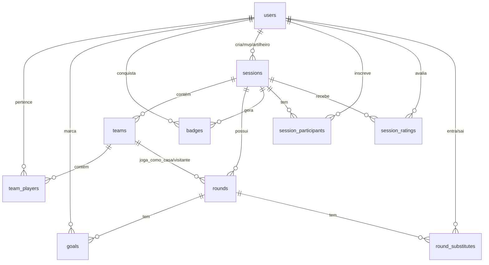

# Modelagem do Banco de Dados - Racha (Metanol FC)

Este documento descreve a estrutura de dados do banco PostgreSQL (gerenciado via Prisma ORM) utilizada pelo sistema, incluindo as entidades existentes e as novas propostas para suportar as avaliações, controle de presenças e substituições.

---

## 1. Diagrama de Entidades (Mermaid)


```mermaid
erDiagram
    users ||--o{ team_players : "pertence"
    users ||--o{ goals : "marca"
    users ||--o{ badges : "conquista"
    users ||--o{ sessions : "cria/mvp/artilheiro"
    users ||--o{ session_participants : "inscreve"
    users ||--o{ session_ratings : "avalia"
    
    sessions ||--o{ teams : "contém"
    sessions ||--o{ rounds : "possui"
    sessions ||--o{ badges : "gera"
    sessions ||--o{ session_participants : "tem"
    sessions ||--o{ session_ratings : "recebe"
    
    teams ||--o{ team_players : "contém"
    teams ||--o{ rounds : "joga_como_casa/visitante"
    
    rounds ||--o{ goals : "tem"
    rounds ||--o{ round_substitutes : "tem"
    
    users ||--o{ round_substitutes : "entra/sai"
```

---

## 2. Dicionário de Dados (Modelos Prisma)

### 2.1 Modelos Existentes

*   **User (`users`)**: Representa os jogadores cadastrados no sistema.
    *   `id` (String, UUID): Chave primária.
    *   `email` (String): E-mail único para login.
    *   `password` (String): Senha criptografada.
    *   `name` (String): Nome completo do jogador.
    *   `nickname` (String?): Apelido.
    *   `position` (Enum: ZAGUEIRO, MEIO, ATACANTE): Posição de preferência.
    *   `avatarIndex` (Int): Índice do avatar selecionado.
    *   `isAdmin` (Boolean): Flag de administrador do racha.
    *   `createdAt` (DateTime).

*   **Session (`sessions`)**: Representa o evento do racha (geralmente semanal).
    *   `id` (String, UUID): Chave primária.
    *   `title` (String?): Título do racha (ex: "Racha Metanol #42").
    *   `date` (DateTime): Data e hora de início.
    *   `status` (Enum: OPEN, IN_PROGRESS, FINISHED): Estado atual do evento.
    *   `createdById` (String): Referência ao Admin que criou a sessão.
    *   `mvpPlayerId` (String?): Jogador eleito MVP da sessão.
    *   `topScorerPlayerId` (String?): Jogador artilheiro da sessão.
    *   `createdAt` (DateTime).

*   **Team (`teams`)**: Os times sorteados para a sessão (geralmente Time A, Time B, etc.).
    *   `id` (String, UUID): Chave primária.
    *   `sessionId` (String): Referência à sessão vinculada.
    *   `name` (String): Nome do time (ex: "Vermelho", "Azul").
    *   `color` (String): Cor de representação.
    *   `totalRating` (Int): Rating acumulado do time (para balanceamento).

*   **TeamPlayer (`team_players`)**: Tabela pivô de relacionamento N:M entre times e jogadores.
    *   `id` (Int): Chave primária.
    *   `teamId` (String): Referência ao Time.
    *   `playerId` (String): Referência ao Jogador.

*   **Round (`rounds`)**: Representa cada partida de 7 minutos realizada na sessão.
    *   `id` (String, UUID): Chave primária.
    *   `sessionId` (String): Referência à sessão.
    *   `roundNumber` (Int): Número sequencial da rodada.
    *   `homeTeamId` (String): Time de Casa.
    *   `awayTeamId` (String): Time Visitante.
    *   `homeScore` (Int): Gols do time de casa.
    *   `awayScore` (Int): Gols do time visitante.
    *   `winnerTeamId` (String?): ID do time vencedor.
    *   `isDraw` (Boolean): Flag de empate.
    *   `createdAt` (DateTime).

*   **Goal (`goals`)**: Registro de gols individuais das partidas.
    *   `id` (Int): Chave primária.
    *   `roundId` (String): Referência à rodada.
    *   `playerId` (String): Referência ao jogador que fez o gol.
    *   `minute` (Int?): Minuto do gol.

*   **Badge (`badges`)**: Insígnias e conquistas acumuladas por jogadores.
    *   `id` (Int): Chave primária.
    *   `playerId` (String): Referência ao jogador.
    *   `type` (Enum: ARTILHEIRO, MVP, ON_FIRE, VETERANO, AZARADO, GOLEADOR).
    *   `sessionId` (String?): Referência opcional à sessão onde a conquistou.
    *   `earnedAt` (DateTime).

---

## 3. Novas Entidades Propostas (Próxima Implementação)

Para suportar as novas regras de negócio do racha, o `schema.prisma` deve ser estendido com as seguintes tabelas e campos:

### 3.1 Alterações em tabelas existentes
*   **User (`users`)**:
    *   `averageGrade` (Float): Nova coluna para armazenar a nota média histórica das avaliações (padrão null - sem avaliação).
    *   `pixKey` (String?): Chave Pix padrão do administrador, usada como fallback quando a sessão não define uma própria (req 2.3).
    *   `password` (String?): Passou a ser opcional — usuários criados via Supabase Auth (Google/e-mail) não têm senha local.
    *   `supabaseId` (String?, único): Id do usuário no Supabase Auth (`sub` do JWT), usado por `syncSupabaseUser` para vincular/criar o registro local automaticamente a cada requisição autenticada (req 2.1/RF02).
    *   `resetToken` (String?, único) / `resetTokenExpiresAt` (DateTime?): Token de uso único (1h de validade) para o fluxo de "esqueci minha senha" do login legado por e-mail/senha (`services/auth.ts`), enviado por e-mail via `utils/mailer.ts`.
*   **Session (`sessions`)**:
    *   `maxPlayers` (Int): Limite máximo de jogadores confirmados para a sessão (padrão `15`).
    *   `pixKey` (String?): Chave Pix específica desta sessão; sobrescreve a do perfil do administrador quando definida.
    *   `price` (Float?): Valor fixo individual a ser pago pelos participantes da sessão. O payload "Copia e Cola" (`utils/pix.ts`) só é gerado quando há chave Pix efetiva (sessão ou perfil) e `price` definidos.
*   **SessionParticipant (`session_participants`)**:
    *   `isPaid` (Boolean): Status de pagamento manual marcado pelo administrador (padrão `false`).

### 3.2 Novas Tabelas

#### SessionParticipant (`session_participants`)
Controla as confirmações de presença e fila de espera.
```prisma
model SessionParticipant {
  id          String            @id @default(uuid())
  sessionId   String
  userId      String
  status      ParticipantStatus @default(CONFIRMED) // CONFIRMED ou WAITING_LIST
  isPaid      Boolean           @default(false)
  createdAt   DateTime          @default(now())

  session     Session           @relation(fields: [sessionId], references: [id])
  user        User              @relation(fields: [userId], references: [id])

  @@unique([sessionId, userId])
  @@map("session_participants")
}

enum ParticipantStatus {
  CONFIRMED
  WAITING_LIST
}
```

#### SessionGrade (`session_grades`)
Armazena o voto Pior/Igual/Melhor que um jogador dá para o outro em uma sessão específica (ver `regras_negocio.md` §1.2 para como isso vira a nota final 1-5).
```prisma
model SessionGrade {
  id          String   @id @default(uuid())
  sessionId   String
  evaluatorId String
  evaluatedId String
  grade       Int      // -1 (Pior), 0 (Igual) ou +1 (Melhor)
  createdAt   DateTime @default(now())

  session     Session  @relation(fields: [sessionId], references: [id])
  evaluator   User     @relation("EvaluatedBy", fields: [evaluatorId], references: [id])
  evaluated   User     @relation("Evaluates", fields: [evaluatedId], references: [id])

  @@unique([sessionId, evaluatorId, evaluatedId]) // Impede avaliações duplicadas
  @@map("session_grades")
}
```

#### RoundSubstitution (`round_substitutions`)
Controla quem substituiu temporariamente quem em uma rodada específica do racha. A troca vale exclusivamente para o `Round` em que foi registrada (req 2.6); a escalação original é restaurada automaticamente na rodada seguinte por não haver persistência além do registro do `Round`.
```prisma
model RoundSubstitution {
  id          Int    @id @default(autoincrement())
  roundId     String
  teamId      String  // time afetado pela troca (necessário pois um Round tem dois times)
  outPlayerId String  // jogador original que saiu (deve pertencer à escalação permanente do time)
  inPlayerId  String  // jogador substituto que entrou (não pode já estar escalado nesta partida)

  round     Round @relation(fields: [roundId], references: [id], onDelete: Cascade)
  team      Team  @relation(fields: [teamId], references: [id])
  outPlayer User  @relation("SubstitutionOut", fields: [outPlayerId], references: [id])
  inPlayer  User  @relation("SubstitutionIn", fields: [inPlayerId], references: [id])

  @@unique([roundId, outPlayerId]) // Um jogador só pode ser substituído uma vez por rodada
  @@map("round_substitutions")
}
```
